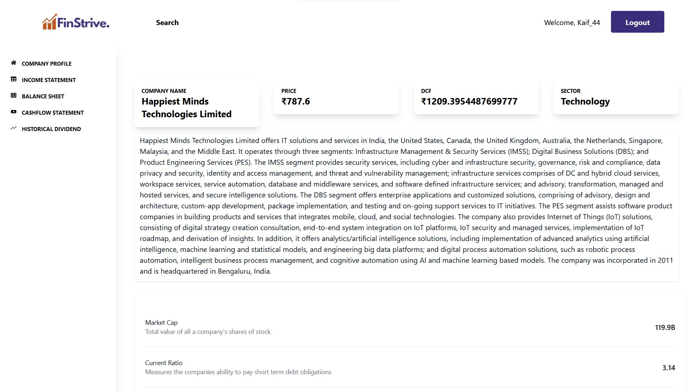

# 📊 FinStrive

A comprehensive financial transaction management and analytics platform built with React, TypeScript, and .NET.

## 🌟 Features

### Transaction Management
- **PDF Import**: Drag-and-drop PDF bank statements for automatic transaction extraction
- **Smart Categorization**: Automatically categorize transactions with manual override
- **Reconciliation**: Map unmapped transactions with autocomplete suggestions
- **Ledger Integration**: Sync with Obsidian-format ledger files

### Analytics Dashboard
- **Real-time Statistics**: Track total income, expenses, net balance, and transaction count
- **Interactive Charts**: 
  - Spending trends over time (line chart)
  - Category breakdown (pie chart)
  - Monthly income vs expenses comparison (bar chart)
- **Time Period Filters**: View data for 7 days, 30 days, 90 days, 1 year, or all time

### Advanced Filtering & Search
- **Full-text Search**: Search across descriptions, categories, and accounts
- **Date Range Filtering**: Filter transactions by custom date ranges
- **Category Filters**: Multi-select category filtering
- **Amount Filters**: Filter by minimum and maximum amounts
- **Transaction Type**: Filter by income, expense, or view all
- **Source Filtering**: Filter by PDF imports or ledger entries
- **Status Filtering**: View mapped, unmapped, or all transactions

### Data Management
- **Sorting**: Click column headers to sort by date, amount, or category
- **Pagination**: Customizable page sizes (20, 50, or 100 transactions per page)
- **CSV Export**: Export filtered transactions to CSV format
- **Bulk Operations**: Select and update multiple transactions at once

## 🛠️ Tech Stack

- **Frontend**: React 18, TypeScript, Tailwind CSS
- **Charts**: Recharts for data visualization
- **Backend**: .NET 10, ASP.NET Core Web API
- **Database**: PostgreSQL with Entity Framework Core
- **Authentication**: JWT-based authentication

## 🚀 Getting Started

### Prerequisites
- Node.js (v16 or higher)
- .NET SDK 10.0
- PostgreSQL database

### Development Mode

Run both frontend and backend with a single command:

```bash
# Option 1: Using the shell script
./run.sh

# Option 2: Using npm
npm start
```

The application will be available at:
- **Frontend**: http://localhost:3000
- **Backend API**: http://localhost:5101
- **Swagger UI**: http://localhost:5101/swagger

### Individual Services

Run services separately:

```bash
# Frontend only
npm run frontend

# Backend only
npm run backend
```

## 📦 Production Build

### Build for Production

```bash
# Build frontend and backend
npm run publish
```

This will:
1. Build the React frontend with optimizations (minified, no source maps)
2. Copy the build to `api/wwwroot`
3. Publish the .NET backend to `./publish`

### Run Production Build

```bash
cd publish
dotnet api.dll
```

The production application will serve both frontend and API from http://localhost:5101

## 📸 Screenshots

### Transaction Dashboard


### Analytics Charts
Interactive charts showing spending trends, category breakdown, and monthly comparisons.

### PDF Import
Drag-and-drop interface for importing bank statements with real-time progress tracking.

## 🔧 Configuration

### Environment Variables

#### Frontend (.env.production)
```
REACT_APP_API_URL=/api
GENERATE_SOURCEMAP=false
```

#### Backend (appsettings.json)
```json
{
  "ConnectionStrings": {
    "DefaultConnection": "Host=localhost;Database=FinStrive;Username=postgres;Password=postgres"
  },
  "JWT": {
    "Issuer": "http://localhost:3000",
    "Audience": "http://localhost:3000",
    "SigningKey": "your-secret-key-here"
  }
}
```

## 📁 Project Structure

```
FinStrive/
├── frontend/                 # React TypeScript application
│   ├── src/
│   │   ├── Components/      # Reusable UI components
│   │   │   ├── TransactionStats/
│   │   │   ├── TransactionCharts/
│   │   │   ├── TransactionList/
│   │   │   └── PdfImportModal/
│   │   ├── Pages/           # Page components
│   │   ├── Services/        # API service layer
│   │   └── Models/          # TypeScript interfaces
│   └── public/
├── api/                      # .NET Web API
│   ├── Controllers/         # API endpoints
│   ├── Services/            # Business logic
│   ├── Repository/          # Data access layer
│   └── Models/              # Entity models
├── backend/                  # Python FastAPI (legacy)
├── run.sh                    # Development startup script
└── build-production.sh       # Production build script
```

## 🎨 Design System

FinStrive uses a modern glassmorphism design with:
- **Color Palette**: Primary blue (#3b82f6), with green for income and red for expenses
- **Typography**: Inter for body text, Outfit for headings
- **Components**: Glass cards with backdrop blur and subtle borders
- **Animations**: Smooth transitions and fade-in effects

## 📊 Key Components

### TransactionStats
Displays four key metrics in animated cards:
- Total Income
- Total Expenses
- Net Balance
- Total Transactions

### TransactionCharts
Three interactive charts:
- **Spending Trends**: Line chart showing daily income and expenses
- **Category Breakdown**: Pie chart of expense categories
- **Monthly Comparison**: Bar chart comparing income vs expenses by month

### TransactionList
Advanced table with:
- Real-time search
- Multi-criteria filtering
- Column sorting
- Pagination
- CSV export

### PdfImportModal
Modern import interface with:
- Drag-and-drop support
- File validation
- Progress tracking
- Success/error notifications

## 🔐 Authentication

The application uses JWT-based authentication:
1. Register or login to receive a JWT token
2. Token is stored in local storage
3. All API requests include the token in the Authorization header
4. Logged-in users are automatically redirected to the transactions page

## 🗄️ Database Schema

### Transactions Table
- `id`: Unique identifier
- `txnDate`: Transaction date
- `descriptionRaw`: Original description from bank statement
- `descriptionClean`: User-edited description
- `amount`: Transaction amount (positive for income, negative for expenses)
- `accountFrom`: Source account
- `accountTo`: Destination account
- `category`: Transaction category
- `source`: Import source (PDF or Ledger)
- `mapped`: Whether the transaction has been categorized

## 🚀 Deployment

### Production Checklist
- [ ] Update database connection string
- [ ] Configure JWT signing key
- [ ] Set up CORS for production domain
- [ ] Build production bundle: `npm run publish`
- [ ] Deploy `./publish` directory to server
- [ ] Configure reverse proxy (nginx/Apache)
- [ ] Set up SSL certificate

### Docker Deployment (Coming Soon)
Docker support is planned for easier deployment.

## 📝 License

This project is private and proprietary.

## 🤝 Contributing

This is a personal project. Contributions are not currently accepted.

## 📧 Contact

For questions or support, please contact the repository owner.

---

**Version 1.0** - Built with ❤️ for better financial management
